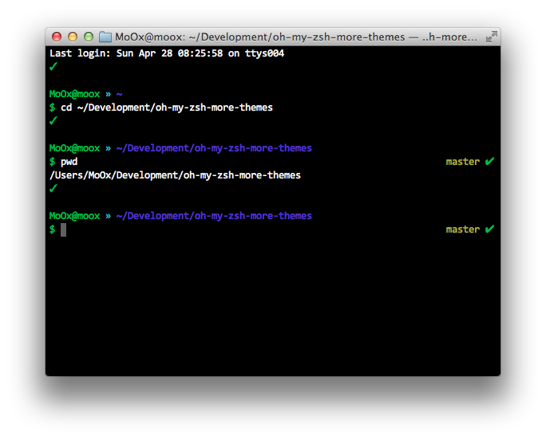

# More theme for Oh My ZSH

Since Oh My ZSH [don't want more theme in the main repo (for now)](https://github.com/robbyrussell/oh-my-zsh#dont-send-us-your-theme-for-now), here is a repo where you can share your theme with the world.

TL;DR Choose a theme in to the [Availables themes](#availables-themes) & checkout how to [install it](#install-a-theme).

## Install a theme

Clone this repo where you want & just use a relative path from `~/.oh-my-zsh/themes/` in your `.zshrc`.

Example: 

```bash
$ cd ~/Development
$ git clone git://github.com/MoOx/oh-my-zsh-more-themes
```

Then in your `~/.zshrc`

```
ZSH_THEME="../../Development/oh-my-zsh-more-themes/moox"
```

## Adding a theme

Just make a Pull Request with your theme & a screenshot int PNG with the same name & add them in the [Availables themes](#availables-themes) section on this README. You can also a link to a color scheme that works great with it ;)

/!\ Please follow [oh-my-zsh rules to submit a theme screenshot](https://github.com/robbyrussell/oh-my-zsh/wiki/Themes#how-to-submit-your-theme).
Thanks.
 
Example: `moox.zsh-theme` & `moox.zsh-theme.png`

---

## Availables themes

### [MoOx](moox.zsh-theme)



Works great with [MoOx/iTerm-theme-Monokai-Soda](https://github.com/MoOx/iTerm-theme-Monokai-Soda).

---

## License

Released under [MIT Licence](http://moox.mit-license.org/)